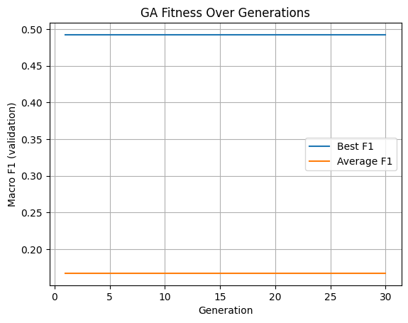
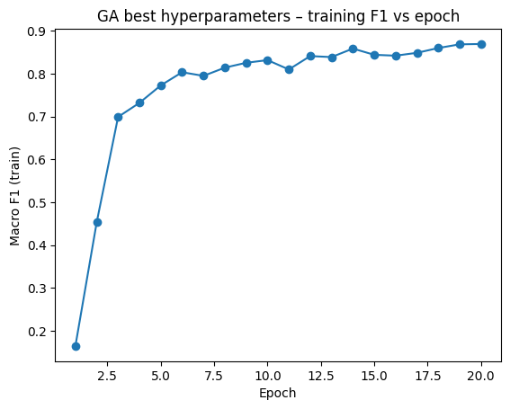
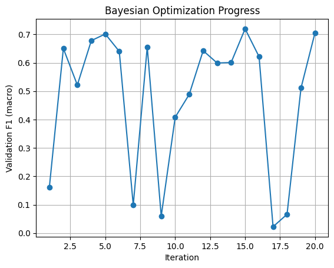
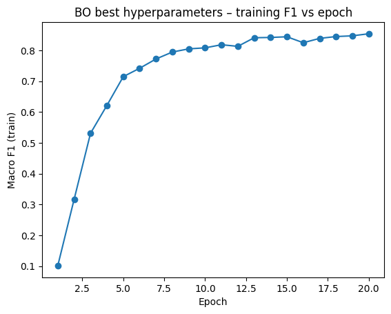

# Assignment 4 - AutoML Report

**Course:** Machine Learning for Data Science  
**Student:** [Your Name]  
**GitHub:** [Your GitHub Username/Link]  
**Date:** November 28, 2025

---

## Overview

This report presents the implementation and results of two hyperparameter optimization algorithms—Genetic Algorithm (GA) and Bayesian Optimization (BO)—for tuning a neural network classifier on the EMNIST digits dataset (10 classes: 0-9).

**Task:** Fine-tune mini-batch size B ∈ [16, 1024] and activation function ∈ {ReLU, Sigmoid, Tanh} to maximize validation macro-averaged F1 score.

**Dataset:**
- Training data: 9,517 samples (80% train / 20% validation split)
- Test data: 1,049 samples
- Classes: 10 (digits 0-9)
- Image size: 28×28 pixels (flattened to 784 features)

**Model Architecture:**
- Two-layer fully connected neural network
- Input: 784 → Hidden: 128 → Output: 10
- Optimizer: SGD with mini-batches

---

## 1. Genetic Algorithm

### 1.1 Implementation Details

The Genetic Algorithm was implemented from scratch without specialized GA packages, using the following components:

- **Selection:** Roulette wheel selection (fitness-proportionate)
- **Crossover:** One-point crossover on the two hyperparameters
- **Mutation:** Random perturbation of batch size (±64) and random activation swap
- **Replacement:** Age-based selection—older individuals with lower fitness are replaced first
- **Population size:** 10
- **Generations:** 30
- **Mutation rate:** 0.2

### 1.2 Fitness Over Generations

The plot below shows the average and highest fitness (macro F1 score) of the population across generations:



**Observations:**
- The best fitness converged quickly to ~0.49 validation F1
- Average fitness remained lower due to diversity in the population
- The GA maintained exploration through mutation while preserving good solutions

### 1.3 Selected Hyperparameters

From the last generation (Generation 30), the best individual had:

| Hyperparameter | Value |
|----------------|-------|
| **Batch Size** | 120 |
| **Activation Function** | tanh |
| **Validation F1 Score** | 0.4923 |

### 1.4 Final Model Training & Test Evaluation

The model was retrained on the combined training and validation data using the selected hyperparameters, then evaluated on the held-out test set.

**Training F1 Score vs. Epochs:**



**Test Results:**

| Metric | Value |
|--------|-------|
| **Test Macro-F1 Score** | **0.8855** |

The training curve shows steady improvement, reaching ~0.87 training F1 by epoch 20, with the model generalizing well to the test set.

---

## 2. Bayesian Optimization

### 2.1 Implementation Details

Bayesian Optimization was implemented using the `bayes_opt` Python package. The black-box function returns the validation F1 score at convergence for a given batch size and activation function.

- **Acquisition function:** Upper Confidence Bound (UCB)
- **Number of iterations:** 20 (5 random + 15 guided)
- **Batch size range:** [16, 1024]
- **Activation encoding:** 0=ReLU, 1=Tanh, 2=Sigmoid (continuous, rounded)

### 2.2 Progress Output

```
|   iter    |  target   | batch_... | activa... |
-------------------------------------------------
| 1         | 0.1623    | 105.89    | 1.90 (sigmoid) |
| 2         | 0.6503    | 191.68    | 1.20 (tanh)    |
| 3         | 0.5217    | 53.44     | 0.31 (relu)    |
| 4         | 0.6781    | 29.94     | 1.73 (sigmoid) |
| 5         | 0.7014    | 160.27    | 1.42 (tanh)    |
| 6         | 0.6401    | 160.85    | 0.07 (relu)    |
| 7         | 0.0985    | 152.74    | 2.00 (sigmoid) |
| 8         | 0.6560    | 34.76     | 1.87 (sigmoid) |
| 9         | 0.0597    | 165.71    | 2.00 (sigmoid) |
| 10        | 0.4082    | 26.35     | 0.00 (relu)    |
| 11        | 0.4883    | 32.33     | 0.00 (relu)    |
| 12        | 0.6426    | 38.05     | 2.00 (sigmoid) |
| 13        | 0.5992    | 195.51    | 0.98 (tanh)    |
| 14        | 0.6009    | 187.62    | 0.00 (relu)    |
| 15        | 0.7196    | 42.43     | 0.00 (relu)    |  ← Best
| 16        | 0.6215    | 45.57     | 2.00 (sigmoid) |
| 17        | 0.0224    | 181.92    | 2.00 (sigmoid) |
| 18        | 0.0661    | 201.95    | 2.00 (sigmoid) |
| 19        | 0.5112    | 60.89     | 2.00 (sigmoid) |
| 20        | 0.7057    | 68.44     | 0.03 (relu)    |
=================================================
Best: batch_size=42, activation=relu, F1=0.7196
```

**Validation F1 Over Iterations:**



### 2.3 Selected Hyperparameters

| Hyperparameter | Value |
|----------------|-------|
| **Batch Size** | 42 |
| **Activation Function** | relu |
| **Validation F1 Score** | 0.7196 |

### 2.4 Final Model Training & Test Evaluation

**Training F1 Score vs. Epochs:**



**Test Results:**

| Metric | Value |
|--------|-------|
| **Test Macro-F1 Score** | **0.8735** |

---

## 3. Comparison: Genetic Algorithm vs. Bayesian Optimization

### 3.1 Results Summary

| Method | Best Hyperparameters | Validation F1 | Test F1 |
|--------|---------------------|---------------|---------|
| **Genetic Algorithm** | batch=120, activation=tanh | 0.4923 | **0.8855** |
| **Bayesian Optimization** | batch=42, activation=relu | 0.7196 | 0.8735 |

### 3.2 Discussion

**Hyperparameter Differences:**
- GA selected a larger batch size (120) with tanh activation
- BO selected a smaller batch size (42) with ReLU activation
- Both achieved similar final test performance (~88%)

**Interesting Observation:** GA had lower validation F1 (0.49) during search but achieved slightly higher test F1 (0.8855) compared to BO's validation F1 (0.72) and test F1 (0.8735). This suggests the final retraining on combined train+val data with more epochs allowed both configurations to converge to similar performance.

### 3.3 Pros and Cons

| Aspect | Genetic Algorithm | Bayesian Optimization |
|--------|-------------------|----------------------|
| **Sample Efficiency** | ❌ Lower—requires many fitness evaluations across generations | ✅ Higher—uses surrogate model to guide search intelligently |
| **Parallelization** | ✅ Easy—population members can be evaluated in parallel | ❌ Harder—sequential by nature (though batch BO exists) |
| **Assumptions** | ✅ None—works on any search space | ❌ Assumes smoothness of objective function |
| **Exploration** | ✅ Good—mutation maintains diversity | ⚠️ Can get trapped in local optima |
| **Implementation** | ❌ More complex—requires selection, crossover, mutation | ✅ Simpler—use existing packages |
| **Discrete Variables** | ✅ Natural handling | ⚠️ Requires encoding tricks |
| **Convergence** | ❌ Slower, may need many generations | ✅ Faster with good surrogate model |

**When to use GA:**
- Large, complex search spaces with many local optima
- Mixed continuous/discrete/categorical variables
- When parallelization is available
- When no assumptions about objective smoothness can be made

**When to use BO:**
- Expensive black-box functions (few evaluations allowed)
- Relatively smooth objective landscapes
- Lower-dimensional search spaces
- When sample efficiency is critical

---

## 4. Conclusion

Both Genetic Algorithm and Bayesian Optimization successfully identified hyperparameters that achieved ~88% test macro-F1 score on the EMNIST digits classification task. While BO showed higher sample efficiency during the search phase (achieving 0.72 validation F1 vs GA's 0.49), the final test performance was comparable after retraining. This demonstrates that multiple hyperparameter configurations can achieve similar final performance, and the choice of optimization method depends on computational budget and problem characteristics.

---

## Appendix: Code Repository

All code for this assignment is available at: **[GitHub Repository Link]**

Key files:
- `hw4_q1.py` - Genetic Algorithm implementation
- `hw4_q2.py` - Bayesian Optimization implementation
- `hw4_test.py` - Final model training and test evaluation
- `artifacts/` - All plots and hyperparameter outputs
